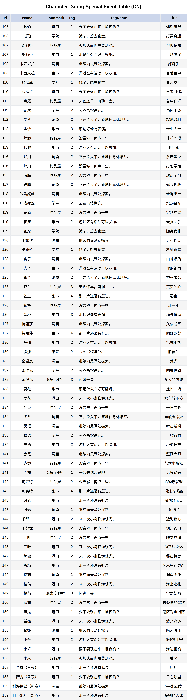
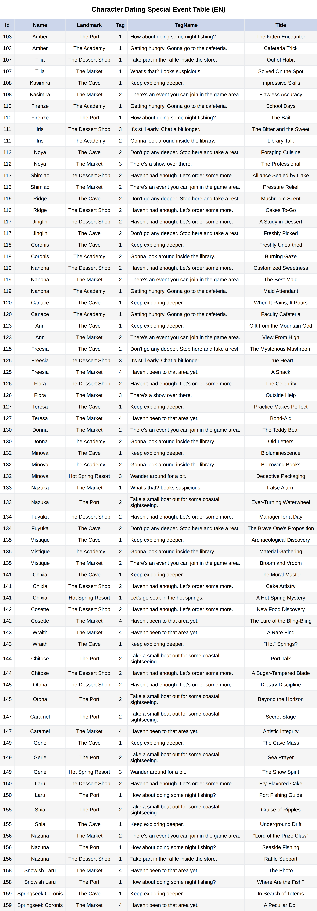
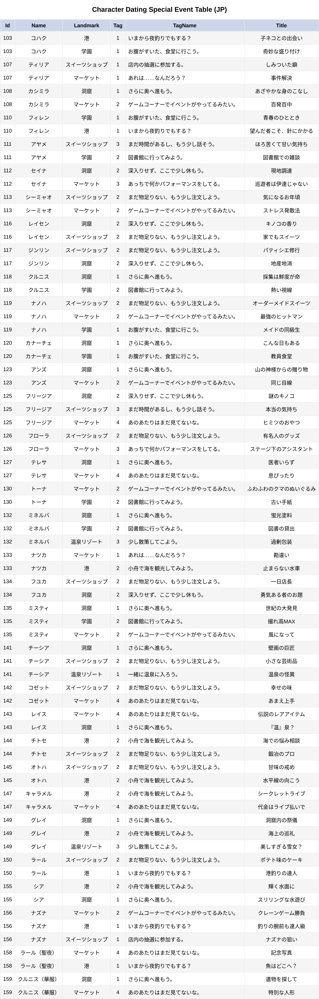
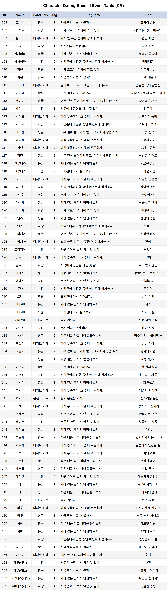
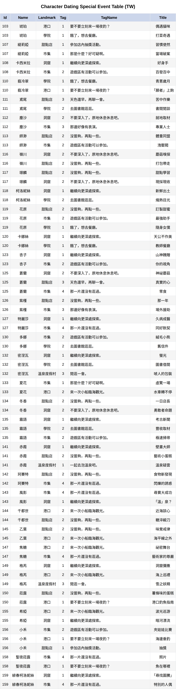

# 斯特拉索拉数据

☝️🙏👌

## <b>📅  Character Dating Speical Event Table</b>

  
🖼️ Table - CN 

  

    
  

  
🖼️ Table - EN 

  

    
  

  
🖼️ Table - JP 

  

    
  

  
🖼️ Table - KR 

  

    
  

  
🖼️ Table - TW 

  

    
  

## Special Thanks

-   **Hiro420** : [StellaSoraParser](https://github.com/Hiro420/StellaSoraParser) - Thanks for providing the parsing tool.

-   **shiikwi** : [UnpackTools](https://github.com/shiikwi/fkStellaSora) - Thanks for providing the unpack tools.

-   **Hiro420** : [StellaSoraData](https://github.com/Hiro420/StellaSoraData) - Thanks for providing the core data support.

  <!-- AND ME -->

## Disclaimer

Yostar Games owns the original assets to the game, all credits go to its rightful owner. \
I am not liable for any damages caused if you get banned from using a mod created by this tool, or its derivatives. \
I DO NOT CLAIM ANY RESPONSIBILITY FOR ANY USAGE OF THIS SOFTWARE, THE SOFTWARE IS MADE 100% FOR EDUCATIONAL PURPOSES ONLY
> **Note:** This disclaimer is copyed from the [StellaSoraData](https://github.com/Hiro420/StellaSoraData) repository.
